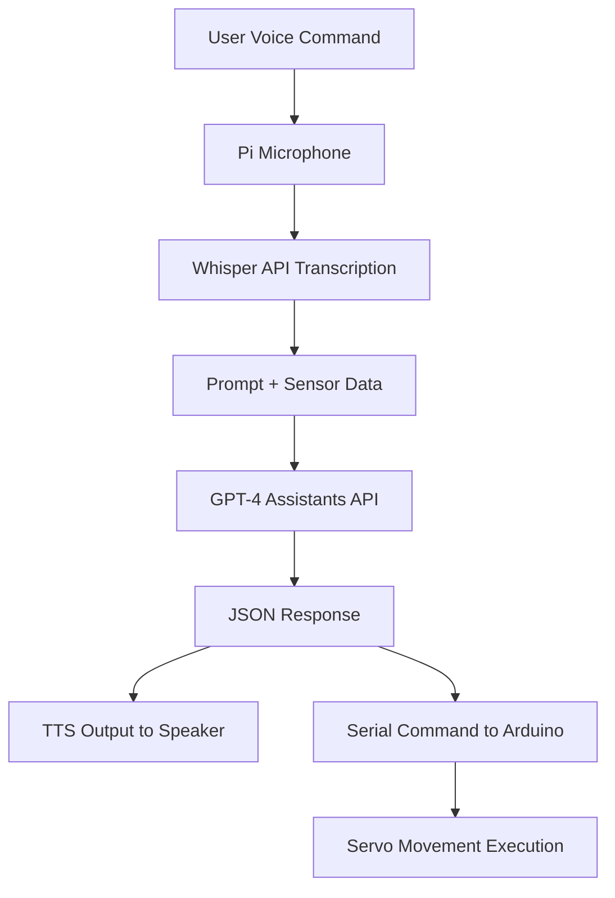

# Cloud-Controlled Quadruped Robot with GPT Assistant

This project showcases the design and implementation of a 3D-printed quadruped robot powered by a cloud-based Large Language Model (LLM) to enable natural human-robot interaction. Combining embedded electronics, speech recognition, and AI decision-making, the system allows users to interact with the robot using voice commands and receive verbal and physical responses in real time.

---

## Overview

The robot is built around a modular architecture:

- **Raspberry Pi 5** handles high-level control and communication.
- **Arduino Pro Micro** controls the 12 servomotors via a PCA9685 board.
- **Sensors**:
  - Front-facing Pi Camera
  - Two ultrasonic distance sensors
  - Wireless USB microphone
- **Speaker** for voice replies (TTS using `espeak`)
- **Cloud AI Pipeline**:
  - Audio transcription: OpenAI Whisper API
  - Reasoning and dialogue: OpenAI GPT Assistants API
  - JSON response containing movement instructions and speech output

---

## Project Goals

- Combine a physical quadruped robot with a cloud-hosted LLM brain
- Enable speech-based interaction using voice commands
- Integrate real-time multimodal sensing and action
- Demonstrate interactive behavior through high-level LLM planning and low-level hardware execution

---

## Software Architecture



---

## Hardware Architecture

The robot is a 12-DOF quadruped platform built on a 3D-printed skeleton, using hobby-grade servos and embedded electronics, organized around a modular control architecture. The system separates high-level logic (handled by a Raspberry Pi) from low-level actuation (handled by an Arduino Pro Micro).

### Mechanical Design

- Based on the **SpotMicro** open-source design
- 3D-printed frame modified to fit:
  - Raspberry Pi 5
  - Battery pack
  - Custom speaker mount
  - Camera and ultrasonic sensors

Each leg has:
- **3 servos**: hip (horizontal), shoulder (vertical), elbow (vertical)
- **Total**: 12 servos, driven by a PCA9685 PWM driver

### Electronic Components

| Component              | Role                             |
|------------------------|----------------------------------|
| Raspberry Pi 5         | Main computer (AI, sensors)      |
| Arduino Pro Micro      | Low-level servo control          |
| PCA9685 Board          | 16-channel PWM servo driver      |
| TD-8125MG Servos (×12) | Joint actuation                  |
| HC-SR04 Sensors (×2)   | Distance measurement             |
| Pi Camera              | Visual input                     |
| USB Microphone         | Voice command capture            |
| Custom Speaker         | Audio output via `espeak`        |
| Buck Converters        | Power regulation for Pi & servos |
| 4S 18650 LiPo Battery  | Main power supply                |

---

### Modular Hardware Design
```mermaid
graph TD;
    %% Power distribution
    A[LiPo Battery] -->|Power| B1[DC-DC Buck Converter<br>5V for Pi]
    A -->|Power| B2[DC-DC Buck Converter<br>6V for Servos]

    %% Power outputs
    B1 -->|5V Output| C[Raspberry Pi 5]
    B2 -->|6V Output| F[12x MG996R Servos]

    %% Pi peripherals
    C -->|USB| D[USB Microphone]
    C -->|GPIO| H[2x HC-SR04 Distance Sensors]
    C -->|CSI| I[Pi Camera Module]
    C -->|USB| J[USB Audio DAC → Speaker]
    C -->|USB Serial| G[Arduino Pro Micro]

    %% Control path
    G -->|I2C| E[PCA9685 Servo Driver]
    E -->|PWM| F


